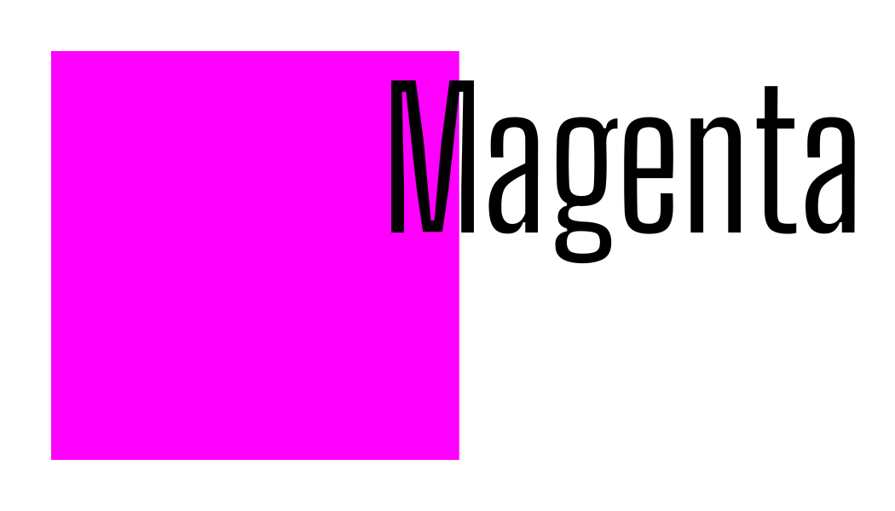

# Magenta
Roblox Proxying - Made Simple

# Getting Started
> [!IMPORTANT]
> It is recommended that you deploy the Proxy via Railway as that is Magenta's Native Hosting Platform.

Magenta is a Self Use (Private) Proxy ment for use with your games only. As Megenta was NOT ment for use by many users to use it at once.

### Hosting on Railway or other providers
1. Fork this repo and have it private. It will required to be private so people do not see your access key.
2. Create an Access Key (Get them from https://uglyburger0.com/tools/uuid as it is just easy)
3. Edit the .env file to your wanted Port and Access Key (Not needed to change the port but you need to change ACCESS_KEY)
4. Create a new Railway Project (Or any other hosting provider) and add the Forked Repo (Plan is recommended because Railway is cheap as heck and the best plan for this is Hobbyist that is $5/Month)
5. Make sure that the .env loaded correctly if not then load it in the variables manually
6. Save your changes and Deploy
7. Connect a domain and you have just deployed Magenta!
> [!NOTE]
> Magenta uses port 8080 as the default
